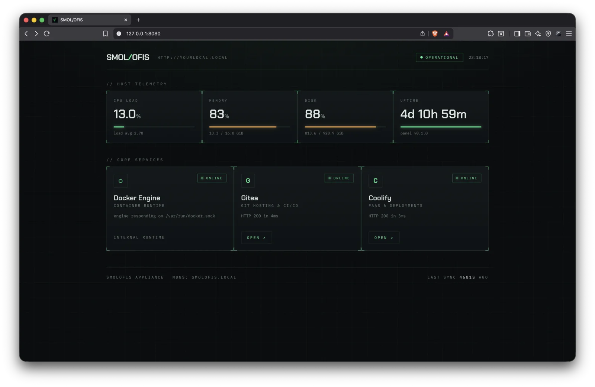

# 📦 SmolOfis

> The "smol" infrastructure appliance for agile web teams. No cloud tax. No enterprise bloat. Just pure developer autonomy.

SmolOfis is a custom, lightweight, headless Linux operating system appliance designed to turn any spare x86 hardware — a NUC, an N100 mini-PC, a retired desktop — into a fully automated, self-hosted DevOps hub for small engineering teams.

Instead of fighting complex configuration scripts or heavy enterprise monoliths, SmolOfis flashes as a single ISO, boots instantly, and exposes a high-performance management dashboard built entirely in Rust.

---

## 🛠️ The Tech Stack

- **OS Base:** Minimal, headless Debian 13 "trixie" rootfs (debootstrap `minbase`) configured for appliance stability.
- **Control Plane:** Compiled Rust binary using `axum` (async web engine), `sysinfo` (telemetry), and `askama` (compiled, type-safe HTML templates) with Tailwind CSS.
- **Git & CI/CD:** Native Gitea integration paired with Gitea Actions for syntax-compatible GitHub pipeline workflows.
- **Orchestration (PaaS):** Coolify engine for managing automated branch-based builds, databases, and multi-server deployments.
- **Networking & Discovery:** Built-in Avahi (`smolofis.local` mDNS resolution) with zero-config DHCP via NetworkManager. Remote access (Tailscale / Cloudflare Tunnel) is on the roadmap.

---

## 🏗️ Architecture & Boot Sequence

When you power on a machine running SmolOfis, it coordinates initialization gracefully via `systemd`:

1. **Kernel Bootstrap:** The stripped-down kernel boots and brings up core networking targets.
2. **Instant UI Panel:** A specialized systemd service launches the `smolofis-panel` Rust binary on port `80`. It immediately serves a responsive "System Initializing..." interface.
3. **Daemon Initialization:** Background systemd workers launch the Docker engine and network discovery layers (`avahi-daemon`).
4. **App Ecosystem Spin-up:** Docker automatically starts pre-configured Gitea, Coolify, and local storage orchestration layers.
5. **Dashboard Transition:** The Rust panel polls the core services locally. Once they pass health checks, the UI shifts smoothly to the operational management cockpit.

---

## 🚧 Project Status: Active Development (Ongoing)

⚠️ **Current Status: Alpha / Work-in-Progress**

SmolOfis is a highly transparent, **ongoing personal portfolio project** aimed at exploring platform engineering, system initialization, and infrastructure automation. 

- **What works right now:** The complete Rust control plane (live host telemetry, an `Initializing → Ready → Degraded` boot-phase state machine, health probes for Docker/Gitea/Coolify over HTTP and the engine's unix socket), the hardened `systemd` boot orchestration, the Debian 13 ISO build pipeline (`scripts/build-image.sh`), a local mock harness (`scripts/dev-mock.sh`), and the GitHub Actions workflow that compiles and publishes flashable images.
- **What has not been proven yet:** The generated ISO has not been booted on physical hardware, and the panel has no automated test suite — both are the current focus.

Because this project is actively evolving, breaking changes to the configuration structure are to be expected. Feature requests, architectural feedback, and code contributions are highly encouraged!

---

## 🗺️ Implementation Roadmap

### Phase 1: Core Dashboard ✅
- [x] Scaffold workspace structure.
- [x] Implement asynchronous service status polling using `tokio` and `reqwest`.
- [x] Complete the Tailwind CSS dark-mode telemetry layout.

### Phase 2: OS Customization ✅
- [x] Build the `debootstrap` workflow configuration (Debian 13 "trixie", `scripts/build-image.sh`).
- [x] Inject custom systemd configurations to manage boot sequencing.
- [x] Lock down the default minimal package selection.

### Phase 3: The "One-Click" ISO
- [x] Create a GitHub Actions workflow to compile the full OS image on every main-branch push.
- [ ] Smoke-test the ISO in QEMU/KVM as part of CI before flashing real hardware.
- [ ] Verify the first flashable `.iso` release boots end-to-end on physical hardware.

### Phase 4: Hardening & Reach (Planned)
- [ ] Unit and integration tests for the panel's state machine and probes.
- [x] Vendor dashboard assets — compiled Tailwind + woff2 fonts embedded in the panel binary; fully offline LANs get the styled UI.
- [ ] Remote access integrations (Tailscale / Cloudflare Tunnel).
- [ ] Atomic A/B image updates with rollback (immutable-OS style).

---

## 🤝 Contributing & Feedback

Since SmolOfis is a collaborative playground to showcase robust systems design, feel free to open an Issue or start a Discussion if you want to chat about:
- Enhancing the `systemd` boot optimization.
- Improving compilation times for the Rust web wrapper.
- Better approaches to sandboxing root filesystems.

Licensed under the MIT License. Built with 🦀 and passion for the independent web.
